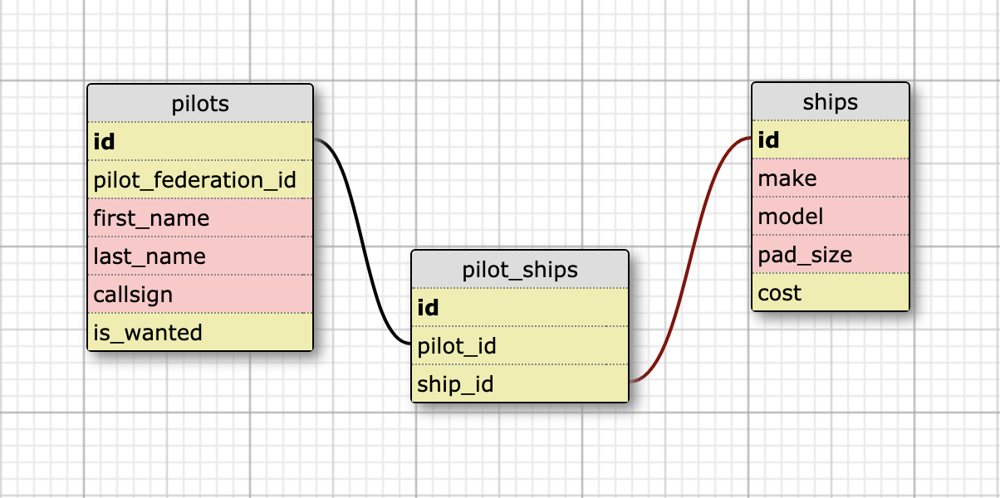

## Titan City Shipyard

### Set Up 
The Titan City Shipyard is ready to go. 

### Description 
The Titan City Shipyard API is a shipyard database for Titan City, an internation space station where commanders of the Pilots Federation come and go by the hour. This API allows for access and management of shipyard activity regarding pilots and their ships. 

### Schema 

### Tech Emphasis 
- JavaScript 
- Node.js 
- Express.js 
- SQL 
- PostgreSQL 
- Knex.js 

### Endpoints

| url | verb | options | sample response |
| ----|------|---------|---------------- |
| `http://localhost:3001/api/v1/pilots` | GET | not needed | Array of all pilots in database |
| `http://localhost:3001/api/v1/ships` | GET | not needed | Array of all accepted ship models |
| `http://localhost:3001/api/v1/shipyard` | GET | not needed | Array of all pilots and ships they own in the shipyard |
| `http://localhost:3001/api/v1/pilots/:id` | GET | not needed | Object of the specified pilot |
| `http://localhost:3001/api/v1/ships/:id` | GET | not needed | Object of the specified ship |
| `http://localhost:3001/api/v1/shipyard/:pilot_id` | GET | not needed | Selected pilot containing an array of their ships stored in the shipyard |
| `http://localhost:3001/api/v1/pilots` | POST | `"pilot": {"pilot_federation_id": <SEVEN DIGIT NUMBER NOT STARTING WITH 0>, "first_name": <STRING>, "last_name": <STRING>, "callsign": <STRING>}` | Add a new pilot to the shipyard database: `` |
| `http://localhost:3001/api/v1/shipyard` | POST | `{"pilot_id": <NUMBER>, "ship_id": <NUMBER>}` | Add new ship to shipyard; assigned to specified pilot |
| `http://localhost:3001/api/v1/pilots` | DELETE | `{"pilot_id": <NUMBER>}` | Delete selected pilot and all records of their ships stored in the shipyard database |

Note: All of these endpoints will return semantic errors if something is wrong with the request.
